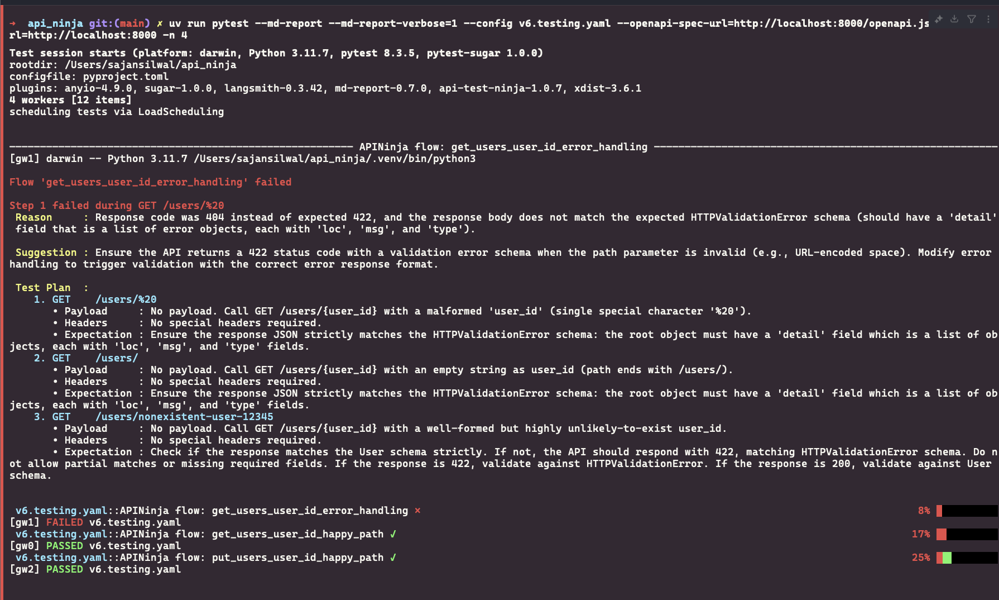
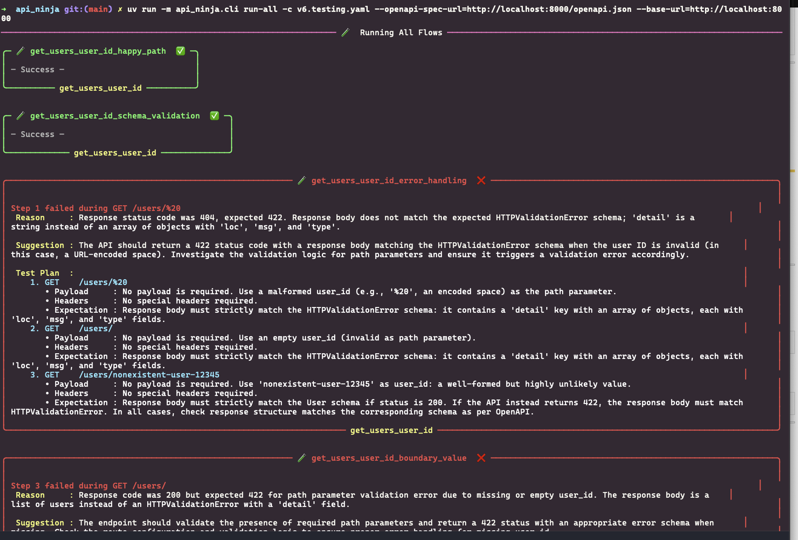
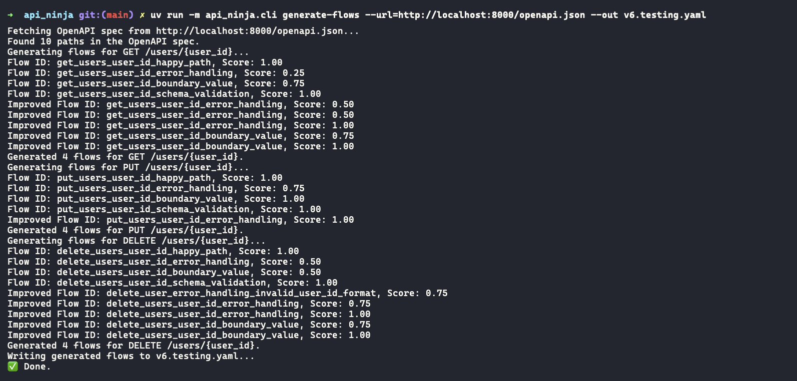
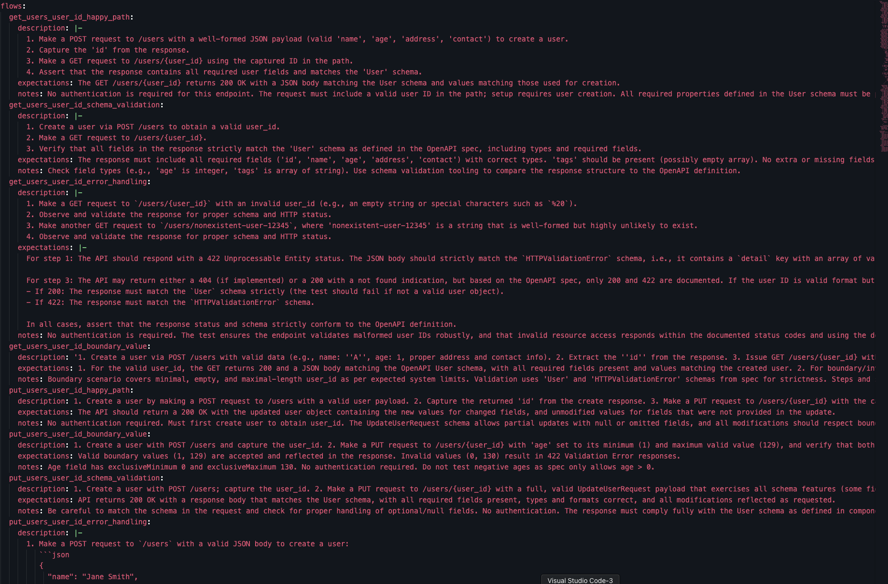

# API Ninja

API Ninja simplifies API testing by allowing users to define test flows in plain English. The framework dynamically generates and executes test steps based on user-defined flows or OpenAPI specifications with a LLM. It validates API responses against expectations and ensures that APIs behave as intended. API Ninja currently only supports OpenAI API and uses it in generating steps, payloads, headers, and other dynamic components.
> **Note:** This alpha version supports only basic JSON requests (`GET`, `POST`, `PUT`, `DELETE`). File uploads via `multipart/form-data` are not yet supported.

---

## Key Features

- **Plain English Test Flows**: Define test flows in simple, human-readable language with expectations, and API Ninja will automatically generate and execute the required steps.
- **Dynamic Step Chaining**: Automatically chains multiple API calls together, passing data between steps as needed.
- **Expectation Validation**: Validates whether API responses meet the defined expectations and provides detailed feedback for failures.
- **OpenAPI Integration**: Requires OpenAPI specifications to generate test flows, payloads, headers, and parameters dynamically.
- **Result Evaluation**: Checks API responses for correctness, schema validation, and status codes.
- **Reporting**: Integrates with pytest for detailed test execution.

---

## Installation

Install via pip:
> **Note**: The PyPI package name is api-test-ninja, which differs from the GitHub repository name.

```bash
pip install api-test-ninja
```

Or install from source using `uv`:

```bash
git clone https://github.com/ssilwal29/api-ninja.git
cd api-ninja
uv pip install -e .
```

---

## Quick Start

### 1. Add Environment Variables
Add your OpenAI API key as an environment variable. Also you can define the model to use.
```
export OPENAI_API_KEY="sk-proj-...."
export LLM_MODEL="gpt-4o"
```

### 2. Define Flows in Plain English

Write test flows in a YAML file, describing the steps and expectations in plain English. Check demo/ for more examples. For example:

```yaml
defaults:
- If you need a user_id, create a user first or use the one from the previous step if applicable.
- Dynamic variables need to be resolved before use so try to plan accordingly when creating the list of actions in the flow.

collections:
  user_endpoints:
    description: User-related API flows
    flows:
    - create_and_delete_user
    - put_user_with_updated_tag

create_and_delete_user:
  description: Use POST /users to create a user. Retrieve the user with GET, then delete the user.
  expectations: Each step should return 2xx on success. Final DELETE should return 204.
  notes:
    - Use a valid user object for creation.
    - Resolve {user_id} from the POST response.
    - Ensure the user is deleted successfully.

put_user_with_updated_tag:
  description: Use PUT /users/{user_id} to update the user's details, including adding a new tag. Verify the updated details with a GET request.
  expectations: Each step should return 2xx on success. The final GET request should return the updated user details, including the new tag.
  notes:
    - Use a valid user object for the update.
    - Resolve {user_id} from the POST response of the user creation step.
    - Ensure the updated tag is present in the user's details after the PUT request.
    - Validate that the GET request returns the updated user details.
```

API Ninja will run following steps for create_and_delete_user
1. Create a user using **POST /users** passing a payload that matched the expected schema generated by LLM.
2. Retrieve the user and `id` of the new created user and retrieve it using **GET /users/{user_id}**.
3. DELETE the user using **DELETE /users/{user_id}** endpoint and `user_id` being the `id` of the created user 
4. Now validates if all the steps resulted in `2xx` and DELETE status_code is 204

After creating the yaml config, you can execute your collections:
```
pytest --config flows.yaml \
  --openapi-spec-url <url-to-openapi-spec> \
  --base-url <api-base-url>
```

Also you can execute tests in parallel using pytest-xdist and prettier test reports combined together with pytest-sugar and pytest-md-report
```
uv run pytest -n 4 --md-report --md-report-verbose=1 \
  --config demo/default.generated.yaml \
  --openapi-spec-url=http://localhost:8000/openapi.json \
  --base-url=http://localhost:8000
```


---

### 3. Generate Flows from OpenAPI Spec

API Ninja can automatically generate test flows for common scenarios based on an OpenAPI specification. For example:
- **Happy Path**: Ensures endpoints work as expected with valid inputs.
- **Error Handling**: Tests how endpoints handle invalid inputs or missing data.
- **Boundary Values**: Tests edge cases for input parameters.
- **Authentication**: Tests cases related to authentication accessing the endpoint
- **Schema Validation**: Ensures the request and response schema are valid and expected as defined

Run the following command to generate flows. 
```
uv run api-ninja \
  generate-flows \
  --url <url-to-openapi-json-spec> \
  --out <path-of-the-out-file>
```

### 4. Import it as a library

You can import the core class using following example.
> **Note:** The name of the pypi package is api-test-ninja but it needs to be imported using `import api_ninja`

```
from api_ninja.core import APINinja
ninja = APINinja(....)
```

---

## Docker Usage

API Ninja provides a Docker image or can be build locally with Dockerfile

### Build the Docker Image (Optional)

To build the image locally:

```bash
docker build -t api-ninja .
```

### GitHub Container Registry (GHCR)

The Docker image is published to **GitHub Container Registry**

To pull the latest image:

```bash
docker pull ghcr.io/ssilwal29/api-ninja:latest
```

To pull a specific version:

```bash
docker pull ghcr.io/ssilwal29/api-ninja:v0.1.0
```

> Replace `v0.1.0` with the version you want.

### Run Tests

Mount your project and run tests:

```bash
docker run --rm \
  -e OPENAI_API_KEY=sk-... \
  -v $(pwd):/app \
  ghcr.io/ssilwal29/api-ninja:latest pytest
```

### Run CLI Commands

For example, to generate test flows from an OpenAPI spec:

```bash
docker run --rm \
  -e OPENAI_API_KEY=sk-... \
  -v $(pwd):/app \
  ghcr.io/ssilwal29/api-ninja:latest \
  api-ninja generate-flows --openapi-spec-path openapi.yaml --base-url https://your-api.com
```

---

## Roadmap

- [x] YAML-based test flow definition
- [x] Flow generation via OpenAPI + LLM
- [x] Variable extraction and chaining
- [x] Pytest-based execution
- [x] Docker support
- [x] Self correcting Flow generation
- [ ] Support additional HTTP methods and payload types
- [ ] Looping and conditional logic in flows
- [ ] Checkpointing for generated and verified flows
- [ ] Filter and run specific flows/collections
- [ ] Visual test result analytics
- [ ] Web-based UI for authoring and managing flows
- [ ] Git metadata tracking for traceability
- [ ] Support for multiple LLM providers

---

## Development

### Lint

```bash
uv run ruff check .
```

### Format

```bash
uv run black .
```

---

## Contributing

Contributions are welcome!

1. Fork the repo
2. Create a feature branch
3. Submit a PR with a clear description

Have an idea or suggestion? Open an issue or start a discussion.

**Found a bug? Want to request a feature or ask a question?**  
Please create an issue on [GitHub](https://github.com/ssilwal29/api-ninja/issues).

---

## Screenshots

Below are some screenshots showcasing the functionality of API Ninja:

- **Executing Flows with Pytest**: This screenshot demonstrates how test flows are executed using Pytest, providing detailed output for each step.
  

- **Executing Flows in Command Line**: This screenshot shows the command-line interface in action, running API Ninja flows with clear and concise output.
  

- **Generating Flows for OpenAPI Spec**: This screenshot highlights the process of generating test flows automatically from an OpenAPI specification.
  

- **Generated Flows Sample**: The output yaml file
  

---

## License

This project is licensed under the MIT License. See the [LICENSE](./LICENSE) file for details.

---

## Contact

For questions or support, please contact silwalsajan@gmail.com
